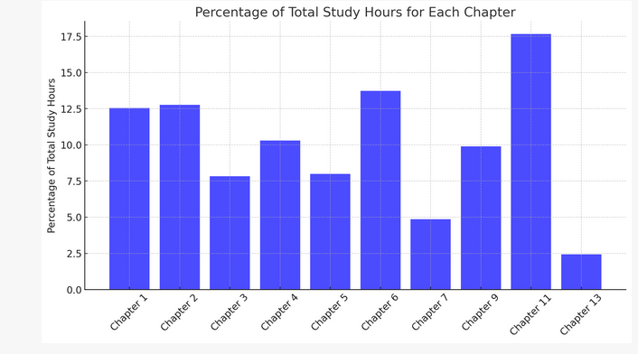

# INF3708-Software-Project-Management Exam Prep

---

### Disclaimer

These resources are meant for learning purposes and comes with no guarantee of accuracy or correctness. Do your own research and use it as a tool to double-check your own work, attempts and understanding.

---

### Please Pay-It-Forward

This repository is shared in the spirit of 'paying it forward.' While the resources are freely available, I encourage you to contribute to the cycle of goodwill. If you find value in this project, I hope you'll use your gained knowledge and resources to assist others in the community, whether that's by contributing to another open-source project, helping a colleague, or sharing your own expertise. This practice fosters a collaborative and generous atmosphere, enriching both individual growth and the broader community.

#### Guiding Principles:
1. **Selflessness**: Paying it forward is rooted in selfless acts of kindness, where individuals help others without expecting personal gain or direct reciprocity.

2. **Generosity**: It emphasizes a generous disposition, where individuals willingly share their resources, knowledge, or time to benefit others in need.

3. **Community Building**: The practice promotes the creation of strong and interconnected communities, as acts of kindness ripple through networks and inspire others to do the same.

4. **Empowerment**: Paying it forward empowers individuals to make a positive impact, no matter how small, fostering a sense of agency and responsibility for the well-being of others.

5. **Gratitude**: It encourages a sense of gratitude for the help one receives and the opportunity to give back, reinforcing the idea that we are all interconnected.

6. **Multiplicative Effect**: By passing on kindness, individuals contribute to a chain reaction of goodwill, potentially reaching and benefiting many more people than the initial act.

7. **Teaching and Learning**: It involves both teaching and learning, as individuals not only offer assistance but also gain valuable experiences and knowledge from their interactions.

8. **Promoting Altruism**: Paying it forward aligns with the philosophy of altruism, where the focus is on the well-being of others rather than personal gain.

9. **Inspiration**: Those who witness or receive acts of kindness are often inspired to pay it forward themselves, perpetuating the cycle of goodwill.

10. **Cultivating a Culture of Kindness**: Ultimately, paying it forward aims to cultivate a culture where kindness and compassion are valued and actively practiced in various aspects of life.
11. 
---
### Chapters
01,02,03,04,05,06,07,09,11,13

---

### Content (wip)

0. Chapter analysis based on past papers (marks per chapter expressed study hours)

---

1. Calculations in dir `./Calculations`
 - calculations and formulae.md

---

2. Glossary of terms in dir `./Glossary of Terms
 - Glossary of terms.md
 - glossary.json

---

3. Past Paper Analysis Oct 2022 in dir `./Past Paper 2022 Oct`
 - ai_answers_and_explanations_2022_oct.md
 - ai_marked_and_area_for_improvment.md
 - formulae and calculations used.md
 - INF3708_2022-Oct-exam.pdf
 - my_answers_and_explanations_2022_oct.md

---

4. Textbook analysis in dir `./Textbook Analysis`
 - summaries.md
---
5. Study Guides by Chapter (wip & AI assisted) in dir `./Study Guides by Chapter (wip & AI assisted)`

