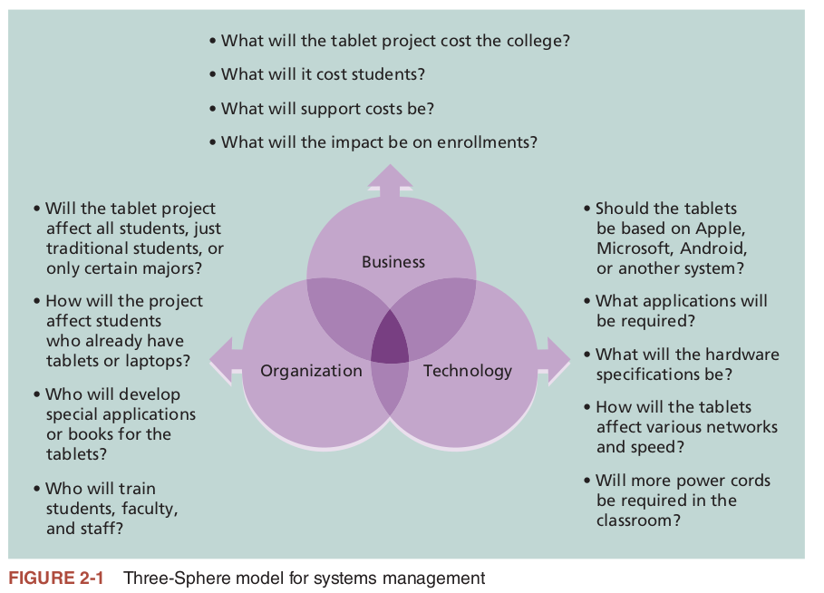
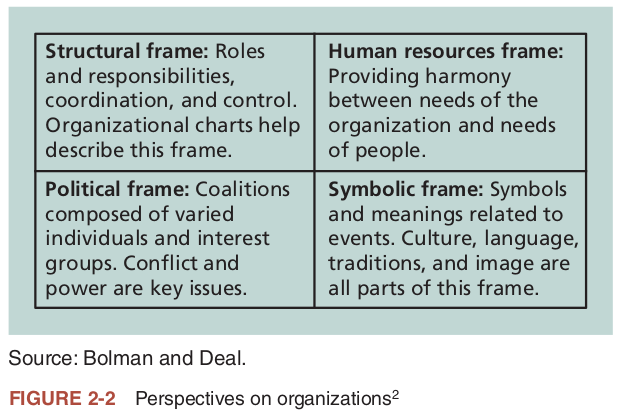
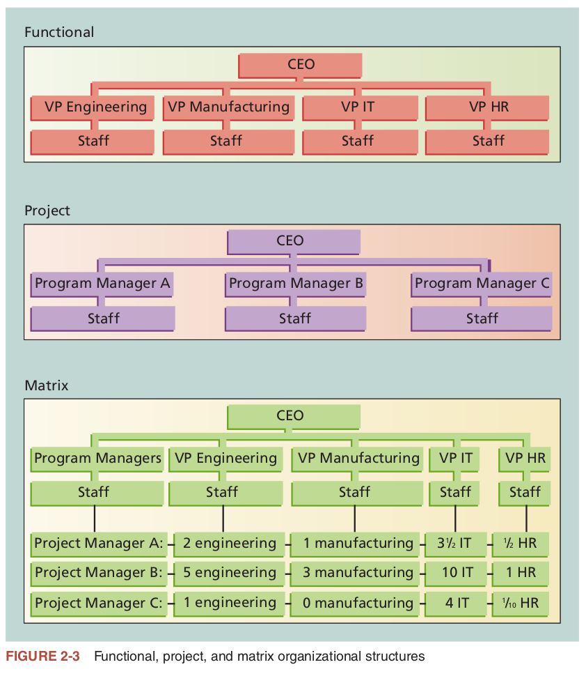
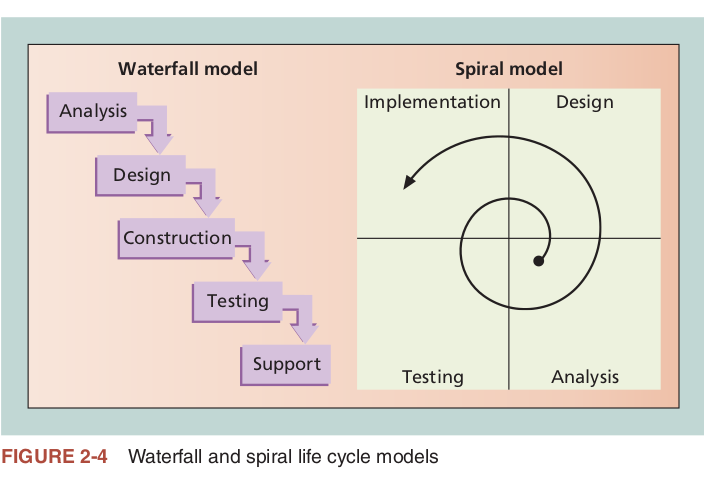

# Study Guide for Software Project Management - Chapter 2

# The Project Management IT Context

1. **A SYSTEMS VIEW OF PROJECT MANAGEMENT**
    - 1.1 What Is a System?
    - 1.2 The Three-Sphere Model of Systems Management

2. **UNDERSTANDING ORGANIZATIONS**
    - 2.1 The Four Frames of Organizations
    - 2.2 Organizational Culture
    - 2.3 Organizational Structure

3. **FOCUSING ON STAKEHOLDER NEEDS**
    - 3.1 Meeting Stakeholder Needs
    - 3.2 Top Management Commitment
    - 3.3 The Need for Organizational Standards

4. **PROJECT AND PRODUCT LIFE CYCLES**
    - 4.1 Project Life Cycles
    - 4.2 Product Life Cycles
    - 4.3 Phase Exits or Kill Points

5. **THE CONTEXT OF INFORMATION TECHNOLOGY PROJECTS**
    - 5.1 The Nature of IT Projects
    - 5.2 Characteristics of IT Team Members
    - 5.3 Diverse Technologies

6. **RECENT TRENDS AFFECTING INFORMATION TECHNOLOGY PROJECT MANAGEMENT**
    - 6.1 Globalization
    - 6.2 Outsourcing
    - 6.3 Virtual Teams
    - 6.4 Agile Project Management
   
7. **Summary**

---
# My Study Guide

## 1. The Systems View of Project Management

### 1.1 What is a system approach?
The section "What Is a Systems Approach?" delves into the importance of using a holistic and analytical approach in project management to solve complex problems. Here are the key points, integrated with my knowledge of software project management:

### Definition and Components:
1. **Holistic View**: A systems approach is a holistic way of looking at complex problems, considering the interacting components and their environment.
  
2. **Systems Philosophy**: This is an overarching model for thinking about systems, emphasizing the interconnectedness of components.

3. **Systems Analysis**: This is a problem-solving technique that involves defining the scope of the system, breaking it down into its components, and evaluating its problems, opportunities, constraints, and needs.

4. **Systems Management**: This involves addressing the business, technological, and organizational aspects of creating, maintaining, and modifying a system.

### Importance in Project Management:
5. **Critical for Success**: Adopting a systems approach is crucial for successful project management. It allows for a comprehensive understanding of how a project fits into the broader organizational context.

6. **Stakeholder Involvement**: The approach mandates the involvement of key stakeholders to ensure that the project aligns with organizational goals and stakeholder needs.

7. **Multi-Dimensional Analysis**: It encourages the consideration of various facets—business, technological, and organizational—when planning and executing a project.

### Case Study Learnings:
8. **Lack of Systems Approach**: The case of Tom Walters shows what can go wrong when a systems approach is not used. His tablet project was planned in isolation, missing many organizational issues.

9. **Importance of Communication**: The case also highlights the importance of effective communication with stakeholders, which is often facilitated by adopting a systems approach.

10. **Preemptive Problem-Solving**: A systems approach could have helped Tom identify and address various issues before they became problematic, thus avoiding complications later on.

The systems approach is particularly relevant in software project management, where projects are often complex and involve multiple stakeholders with varying interests. It helps in ensuring that all aspects are considered and integrated into the project planning and execution phases.

### 1.2 The 3-Sphere Model
The section "The Three-Sphere Model for Systems Management" discusses the critical importance of considering three main spheres—business, organization, and technology—when managing projects. Here are the key points, integrated with my understanding of software project management:

### The Three Spheres:
1. **Business Sphere**: This involves understanding the financial viability, market demands, and overall business value of the project.

2. **Organizational Sphere**: This focuses on the people involved, the organizational culture, politics, and the impact of the project on various departments within the organization.

3. **Technological Sphere**: This pertains to the actual technology being used or developed, the technical requirements, and the challenges involved in using or implementing that technology.

### Importance in Project Management:
4. **Holistic View**: Successful project management requires a balanced focus on all three spheres, rather than concentrating solely on technological aspects.

5. **Value Addition**: Senior management, including organizational leaders like CEOs or college presidents, are interested in how the project adds value across all three spheres.

6. **Interrelated Phases**: A three-sphere approach encourages viewing a project as a series of connected phases, each impacting the business, organization, and technology aspects.

### Common Pitfalls:
7. **Technology Focus**: IT professionals often get caught up in the technological aspects, neglecting the business and organizational sides of projects.

8. **People Problems**: Frustration often arises when dealing with organizational politics or interpersonal issues, which are crucial but sometimes overlooked aspects of project management.

9. **Financial Oversight**: Important business questions like cost-benefit analysis or the choice between in-house development and off-the-shelf solutions are sometimes ignored.

### Benefits of a Holistic Approach:
10. **Improved Success Rate**: Integrating business and organizational issues into project planning increases the likelihood of project success by ensuring alignment with broader organizational goals.

This Three-Sphere Model is particularly relevant in software project management, where the complexity often spans across technological, organizational, and business dimensions. Ignoring any of these could lead to project failure or suboptimal results.

---

## 2. Understanding Organizations

### 2.1 The 4 Frames of Organizations
The section on "The Four Frames of Organizations" introduces a framework for understanding organizations through four distinct lenses: structural, human resources, political, and symbolic. Here are the key points, integrated with my understanding of software project management:

### The Four Frames:

1. **Structural Frame**: This frame emphasizes the organization's structure, focusing on roles, responsibilities, and the alignment with management goals. In software projects, decisions like centralizing or decentralizing the IT department can be crucial.

2. **Human Resources (HR) Frame**: This frame aims to balance the needs of the organization with those of its employees. For example, project schedules need to be realistic, considering the available skills and well-being of the team members.

3. **Political Frame**: This frame deals with the dynamics of power, resources, and competition within the organization. Understanding who supports or opposes a project can be key to its success. Software projects often require negotiating for resources or managing conflicting agendas among stakeholders.

4. **Symbolic Frame**: This frame focuses on the culture and symbolism within the organization. It's about understanding the deeper meanings behind actions and events. For example, the dress code, meeting styles, or CEO's presence in a project kick-off meeting can have varying symbolic significance.

### Relevance in Software Project Management:

5. **Multi-Frame Approach**: Successful project managers should be adept at navigating all four frames to understand the complexities of the organization they work within.

6. **Conflict Resolution**: Utilizing the HR and Political frames effectively can help in resolving conflicts between team members or between the project and other organizational units.

7. **Cultural Sensitivity**: In globally distributed software projects, understanding the symbolic frame is crucial to account for cultural differences among international stakeholders.

8. **Resource Allocation**: The political frame is particularly important for garnering support for resource allocation, a common challenge in software projects.

9. **Employee Well-being**: Software projects are often marathons and not sprints; the HR frame helps in ensuring that team members are not overworked, thereby reducing the risk of burnout.

10. **Organizational Alignment**: The structural frame ensures that the software project aligns with organizational goals and governance models, which is essential for the project's long-term success.

11. **Stakeholder Management**: Effective stakeholder management involves understanding the politics and symbolism as perceived by different stakeholders, including top management.

Understanding these frames not only enriches the project manager's toolkit but also provides a more nuanced view of how software projects interact with various facets of the organization. This multi-frame approach can be a key differentiator for project success.

### 2.2 Organizational Structure
The section on "Organizational Structures" discusses the impact of an organization's structure on project management, particularly focusing on three general classifications: functional, project-oriented, and matrix. Here are the key points, integrated with my knowledge of software project management:

### Types of Organizational Structures:

1. **Functional Structure**: In this structure, departments are defined by the functions they perform, such as IT or HR. Project managers in this type of organization often have limited authority and resources, and may require strong top management sponsorship for projects to succeed.

2. **Project-Oriented Structure**: Here, the organization is structured around projects rather than functional disciplines. Project managers have higher authority and can directly control resources, but this can lead to resource inefficiency.

3. **Matrix Structure**: This is a hybrid that combines elements of both functional and project-oriented structures. Employees have dual reporting relationships - they report both to the functional manager and the project manager.

### Other Variants:

4. **Other Structures**: Besides the primary three, other organizational structures like organic or simple, multi-divisional, virtual, hybrid, and PMO are mentioned. These structures offer varying levels of authority and resource control to the project manager.

### Relevance in Software Project Management:

5. **Authority Levels**: Understanding the organizational structure is crucial for project managers, as it influences their level of authority and the degree of support they can expect.

6. **Resource Allocation**: The type of structure impacts how resources are allocated. For example, in a matrix structure, resource conflicts can become a significant issue if not managed well.

7. **Top Management Sponsorship**: In functional structures, project managers may need strong sponsorship from top management to get the necessary support and resources.

8. **Efficiency and Resource Utilization**: Project-oriented structures might result in inefficient resource utilization. For example, having a technical writer assigned full-time to a project may not be cost-effective if their skills are not continuously needed.

9. **Systems Approach**: Utilizing a systems approach can help project managers make decisions that benefit the entire organization. For example, opting to hire a contractor for specific tasks instead of allocating a full-time employee can be more efficient.

10. **Complexity in Large Organizations**: Large organizations might use a mix of various structures, adding layers of complexity for project managers.

11. **Decision-Making**: The organizational structure can often influence the project manager's decision-making process, especially when it comes to resource allocation and handling of personnel.

Understanding the organizational structure is essential for software project managers as it affects almost every aspect of project execution, from resource allocation to decision-making authority.

### 2.3 Organizational Culture
The section on "Organizational Culture" explores how the culture of an organization can have a profound impact on project management. Here are the key points, integrated with my knowledge of software project management:

### Characteristics of Organizational Culture

1. **Member Identity**: A culture where employees identify more with the organization rather than their specific job role often fosters a more collaborative and committed project environment.

2. **Group Emphasis**: Organizations that prioritize teamwork generally see more success in project management. This is particularly true in Agile environments where team collaboration is essential.

3. **People Focus**: A people-centric culture considers the individual needs of employees in managerial decisions, which can lead to higher job satisfaction and better project outcomes.

4. **Unit Integration**: The more integrated the departments or units within an organization, the easier it is for project managers to coordinate activities and resources, aiding in project success.

5. **Control**: A balanced approach to control mechanisms like rules, policies, and supervision is often best for project management. Too much control can stifle creativity, while too little can lead to chaos.

6. **Risk Tolerance**: A culture that encourages risk-taking is often more innovative and agile, important traits for software project management where technologies and requirements can quickly change.

7. **Reward Criteria**: Performance-based rewards usually lead to higher levels of motivation among project team members, thereby affecting project success positively.

8. **Conflict Tolerance**: Open communication and the ability to constructively address conflicts are vital for project success. This is especially true in Agile methodologies like Scrum, where frequent communication is encouraged.

9. **Means-Ends Orientation**: A balanced focus between the outcomes and the processes used to achieve them is crucial. Agile frameworks like Scrum emphasize this by focusing on delivering working software while refining processes through retrospectives.

10. **Open-Systems Focus**: Organizations that are aware of and respond to external changes can adapt more quickly, which is vital for project management given the fast-paced nature of technological change.

### Relevance to Software Project Management:

11. **Cultural Fit with Methodologies**: The organizational culture should align with the project management methodology being used. For instance, Agile methodologies require a culture of collaboration, openness, and adaptability.

12. **Stakeholder Communication**: The organizational culture can influence how project managers communicate with stakeholders, which is a critical aspect of project success.

13. **Resource Allocation**: The cultural emphasis on team vs. individual performance can impact how resources are allocated, affecting both project planning and execution.

14. **Change Management**: A culture open to change is more likely to successfully implement new project management practices or tools, such as transitioning from Waterfall to Agile.

Understanding the organizational culture is not just beneficial but essential for project managers. It can influence everything from team dynamics and communication to the overall success of the project.

---

## 3. Focusing on Stakeholder Needs
The section on "Focusing on Stakeholder Needs" delves into the importance of recognizing and managing the relationships with all project stakeholders for project success. Here are the key points:

### Stakeholder Types and Importance:

1. **Internal vs. External Stakeholders**: Internal stakeholders include project sponsors, team members, and other functional managers, while external stakeholders can be customers, suppliers, or government bodies. 

2. **Broad Impact of Projects**: Even stakeholders not directly involved in a project can be affected due to the use of limited organizational resources.

3. **Purpose of Project Management**: The central goal is to meet project requirements and satisfy stakeholders, making stakeholder management crucial.

### Case Study Insights:

4. **Limited Stakeholder View**: In the case of the tablet project, Tom Walters had a limited view of who the stakeholders were, focusing mainly on the IT department.

5. **Exclusion of Key Stakeholders**: Tom did not include important stakeholders like students, faculty, or senior administrators in the planning process.

### Frames for Understanding Stakeholders:

6. **Structural Frame**: Expanding the view of the organizational structure can help identify key stakeholders across departments.

7. **Human Resources Frame**: Understanding the organizational culture and people can help identify those who will support or oppose the project.

8. **Political Frame**: Recognizing interest groups most affected by the project helps in managing their expectations and mitigating risks.

9. **Symbolic Frame**: Understanding what the project symbolizes can help in managing expectations and opposition.

### Lessons for Project Managers:

10. **Holistic Skillset**: Technical and analytical skills alone are not enough. Stakeholder management and organizational understanding are essential for project success.

11. **Endorsement for Buy-in**: Securing strong endorsement from high-level stakeholders like the college president can lend credibility and help overcome opposition.

### Relevance to Software Project Management:

12. **Agile Approaches**: In Agile methodologies like Scrum, stakeholder engagement is continuous and iterative, making their identification and management even more crucial.

13. **Resource Allocation**: Understanding stakeholder needs helps in better allocation of both human and technological resources.

14. **Risk Management**: Proper stakeholder identification and management are key aspects of risk management in software projects.

15. **Change Management**: Stakeholders play a significant role in the change management process, especially when a project involves new technologies or methodologies.

Understanding and managing stakeholders effectively is not just beneficial but essential for project managers as it affects every facet from planning and execution to the ultimate success of the project.

### 3.1 Top Management Commitment
The section on "The Importance of Top Management Commitment" emphasizes the critical role that executive support plays in the success of a project. Here are the key points:

### Fundamental Necessity of Top Management Support:

1. **Crucial for Success**: Studies have shown that top management commitment is one of the key factors associated with project success.

2. **Champion Role**: Sometimes there's a senior manager who acts as a 'champion' for the project, advocating and providing the necessary support.

### Reasons Why Top Management Support is Important:

3. **Resource Allocation**: Project managers need adequate resources like money and human capital, which is more likely if they have top management backing.

4. **Timely Approvals**: Top management's commitment ensures that the project manager can secure timely approvals for unique project needs such as additional hardware or special pay.

5. **Political Support**: Top management can help project managers navigate the political landscape of the organization, particularly when projects cut across functional areas.

6. **Mentorship and Coaching**: Senior managers can offer invaluable advice on leadership issues, especially for project managers who come from technical backgrounds.

### Organizational Aspects:

7. **Environment that Values IT**: Project managers perform best when top management values the IT department and its contributions.

8. **Standards and Guidelines**: An organization that sets standards for good project management will naturally assist project managers in succeeding.

### Relevance to Software Project Management:

9. **Agile and Scrum**: In Agile methodologies like Scrum, the 'Product Owner' often needs the support of top management to prioritize the backlog and make key decisions.

10. **Risk Management**: Top management's commitment is critical for risk mitigation strategies, especially in IT projects which often have unforeseen challenges.

11. **Change Management**: Executive sponsorship is often crucial in implementing change management processes, particularly in large software projects.

12. **Quality Assurance**: With adequate resources and executive backing, the project can maintain higher quality standards, especially vital in software development where testing is key.

13. **Skill Development**: In the software industry, technologies are continually evolving. Top management's support in skill development can be critical for the project's success.

Top management's commitment not only aids in the immediate needs of the project but also sets the stage for long-term success by fostering an environment that values project management and technology.

### 3.2 Need for Organizational Commitment to IT
The section "The Need for Organizational Commitment to Information Technology" underscores the importance of an organization's commitment to IT for the success of IT projects. Here are the key points:

### Role of Organizational Attitude Toward IT:

1. **Crucial for Project Success**: An organization's commitment to IT directly impacts the success of IT projects. 

2. **C-Suite Involvement**: Organizations often have a Chief Information Officer (CIO) or equivalent to signify the importance of IT.

### Leadership and Management:

3. **Leadership Style of CIO**: The CIO's leadership style is pivotal in gaining organizational commitment and motivating IT workers.

4. **Vision Over Control**: Traditional 'command-and-control' styles are less effective in today's digital business environment; visionary leadership is more suitable.

### Empowerment and Involvement:

5. **Cross-Functional Teams**: Companies often involve people from non-IT areas to work on large IT projects to improve end-user involvement.

6. **Employee Empowerment**: Enabling employees at all levels to use IT effectively is crucial for project success.

### Real-world Example:

7. **Hilton Worldwide Case**: Hilton used a combination of analytics software and a customer-centric approach (HEART) to improve customer service and loyalty, thereby increasing profits.

### Relevance to Software Project Management:

8. **End-User Focus**: In software projects, involving end-users from the initial stages can provide valuable insights and improve project outcomes.

9. **Agile Leadership**: The shift from a 'control first' to a 'vision first' approach aligns well with Agile methodologies that encourage adaptive planning and stakeholder collaboration.

10. **Data-Driven Decisions**: The use of analytics software like Hilton's SALT can be adopted in software projects for real-time tracking and improvement.

11. **Employee Training**: In the software industry, continuous learning is vital. Organizations committed to IT often invest in employee training, leading to better project results.

The commitment of an organization to IT not only affects resource allocation but also influences the culture, collaboration, and overall success of IT projects.

### 3.3 The Need for Organizational Standards
The section "The Need for Organizational Standards" highlights the importance of having standardized procedures and guidelines for effective project management. Here are the key points:

### Importance of Standards:

1. **Lack of Guidelines**: Many organizations do not have set standards or guidelines for project management, which can lead to inconsistencies and inefficiencies.

2. **Senior Management Support**: The adoption and enforcement of standards require support from top management.

### Types of Standards:

3. **Document Templates**: Providing standard forms or templates for common project documents can streamline the planning and reporting process.

4. **Reporting Guidelines**: Specific guidelines on how project status should be communicated to top management can be very helpful, especially for new project managers.

5. **Standard Format for Proposals**: A standardized format for project information can aid in project portfolio management and decision-making.

### Organizational Structures for Project Management:

6. **Project Management Office (PMO)**: Some organizations establish a PMO to maintain project governance and assist project managers.

7. **Chief Project Officer (CPO)**: A new organizational role suggested to oversee and standardize project management across the organization.

### Professional Development:

8. **Career Paths for PMs**: Some organizations create career paths specifically for project managers to grow and excel.

9. **Certification Requirements**: Organizations may require Project Management Professional (PMP®) certification for project managers and some level of project management training for all employees.

### Relevance to Software Project Management:

10. **Code of Conduct**: In software projects, similar standards can be extended to coding practices, code reviews, and software architecture.

11. **Agile Frameworks**: In the context of Agile methodologies, standards can be adapted to include Agile-specific best practices, templates, and reporting structures.

12. **Quality Assurance**: Standardized testing and QA procedures can ensure higher quality software output.

13. **Resource Allocation**: Having a standardized approach can simplify the resource allocation process, making it easier to manage software projects.

By implementing such standards, an organization not only increases its efficiency but also demonstrates a commitment to project management, increasing the chances of project success.

---

## 4. Project & Product Lifecycles
### 4.1 Project Lifecycle
The section "Project Life Cycle" outlines the different phases that projects pass through from initiation to completion. Here are the key points:

### Basic Phases of the Project Life Cycle:

1. **Starting the Project**: The initial phase where the project is defined at a broad level. You identify key deliverables, stakeholders, and initial requirements.

2. **Organizing and Preparing**: In this phase, detailed planning and scheduling take place, including defining more specific deliverables and resource allocation.

3. **Carrying Out the Work**: The execution phase where the project team works to produce the project's deliverables.

4. **Finishing the Project**: This phase includes closing out the project, ensuring all work is completed, and obtaining formal acceptance.

### Distinguishing from Process Groups:

5. **Not to be Confused**: These phases should not be confused with the project management process groups, which are initiating, planning, executing, monitoring and controlling, and closing.

### Characteristics of Each Phase:

6. **Work Definition**: Each phase defines what work will be performed and by whom.

7. **Deliverables**: Each phase has its own specific deliverables that must be produced and approved.

### Resource Needs and Uncertainty:

8. **Resource Needs**: Resource needs are usually lowest in the early phases and peak during the middle phases of the project.

9. **Uncertainty and Influence**: The level of uncertainty is highest in the early phases, and this is also when stakeholders have the greatest opportunity to influence the project.

### Cost of Changes:

10. **Expensive Changes**: Making changes later in the project is usually more expensive and disruptive.

### Project Requirements and Objectives:

11. **Certainty Increases**: As the project progresses through its life cycle, the certainty of its completion generally increases.

12. **Focus on Requirements**: The final phase is crucial for ensuring that the project has met its stated requirements and objectives and gains formal acceptance from the sponsor.

### Relevance to Software Project Management:

13. **Agile Consideration**: In software project management, Agile methodologies may introduce additional phases or alter the traditional life cycle to be more iterative and responsive to change.

14. **Quality Assurance**: In software projects, each phase may include specific quality assurance checkpoints.

15. **Code Deliverables**: In the context of software, deliverables can include documentation, code segments, and software modules.

Understanding the project life cycle is crucial for effective project management as it provides a structured approach for moving a project from the initial idea to successful completion.

### 4.2 Product Lifecycle
The section on "Product Life Cycles" offers a comprehensive look at the different types of life cycles that products, particularly in IT, can go through. Here are the key points:

### Types of Product Life Cycles:

1. **Predictive Life Cycle**: Also known as the waterfall model, this approach defines scope, schedule, and cost early in the project. Changes to the scope are carefully managed.
  
2. **Iterative Life Cycle**: The scope is defined early, but time and cost estimates are modified as understanding of the product increases. Suitable for projects with a high degree of change and low frequency of delivery.

3. **Incremental Life Cycle**: Deliverables are produced through a series of iterations. The final product is complete only after the last iteration. Works best when there's a low degree of change and a high frequency of delivery.

4. **Adaptive Life Cycle**: Also known as agile or change-driven, this approach involves stakeholders defining and approving the detailed scope before each iteration. Suitable for projects with both a high degree of change and high frequency of delivery.

5. **Hybrid Life Cycle**: Combines various approaches based on the nature of the work. Used often in modern organizations.

### Other Predictive SDLC Models:

6. **Spiral Life Cycle Model**: Based on iterative or spiral approach, it allows changes and revisions later in the project life cycle.

7. **Prototyping Life Cycle Model**: Used to clarify user requirements through prototypes. Requires heavy user involvement.

8. **RAD (Rapid Application Development) Model**: Involves heavy user involvement and rapid prototyping, facilitated by tools like CASE, JRP, and JAD.

### Considerations for Software Projects:

9. **SDLC Framework**: Systems Development Life Cycle (SDLC) serves as a framework for developing information systems.

10. **Factors to Consider**: The degree of change in requirements and frequency of delivery of useful results are critical in deciding which life cycle to use.

11. **Co-existence of Models**: Predictive and adaptive approaches are not mutually exclusive and can be used in tandem, especially in complex projects.

12. **User Involvement**: In prototyping and RAD models, heavy user involvement is required to clarify requirements and approve prototypes.

### Relevance to Software Project Management:

13. **Agile Frameworks**: In software development, Agile frameworks like Scrum often adopt an adaptive life cycle for greater flexibility.

14. **Project vs Product**: In the software industry, it's crucial to differentiate between project life cycles, which focus on the development process, and product life cycles, which focus on the product from its inception to retirement.

15. **Quality and Speed**: Models like RAD and Agile aim to produce systems quickly without sacrificing quality, which is particularly relevant in fast-paced software development environments.

Understanding the various life cycles and when to apply them can provide significant benefits in managing IT and software development projects effectively.

### 4.3 Project Phases & Management Reviews
Certainly, here are key points that stand out from the section, contextualized with software project management:

1. **Phase Reviews**: The section highlights the importance of reviewing the status of a project at the end of each phase. In software projects, these reviews can include code audits, feature completeness checks, and security assessments.
  
2. **Management Reviews or Phase Exits**: These are crucial for deciding whether the project should continue, be redirected, or terminated. In the software world, this could be likened to go/no-go decisions based on milestones reached, budgets, and timelines.

3. **Organizational Compatibility**: Projects must be aligned with organizational goals, and this alignment should be reassessed at each phase. In a software context, this could mean ensuring that the project aligns with the overall tech strategy, such as cloud migration or a shift toward a microservices architecture.

4. **Ongoing Top Management Involvement**: The section suggests that waiting until the end of a phase for management input is risky. In software project management, this could translate into regular sprint reviews or stakeholder demos to ensure that the project is aligned with business objectives.

5. **Regular Updates and Monitoring**: Many projects are reviewed by management on a regular basis, sometimes even daily. For software projects, this could mean daily stand-ups or weekly status updates that provide quick insights into the project status, helping in early identification of issues.

6. **Case Study Example**: The example given illustrates the importance of phase-based decision-making to avoid wasting time and resources. In software development, this approach allows for agile pivoting based on stakeholder feedback or changing market conditions.

7. **Cost of Skipping Reviews**: Skipping these reviews and proceeding without validation can lead to wasted resources and misalignment with organizational goals. In software projects, this could result in building features that are not needed or missing critical security and performance checks.

Understanding and applying these principles can greatly aid in the successful management of software projects.

---

## 5. The Context of IT Projects
### 5.1 The Nature of IT Projects

1. **Diversity in Scope and Scale**: IT projects can range from small installations of off-the-shelf hardware to large, complex software development projects. This variability means that one-size-fits-all project management approaches are unlikely to work across all IT projects.

2. **Range of Technologies**: The section underscores the diversity of hardware and software technologies that can be involved in an IT project—from mainframes to mobile devices and from simple Excel macros to complex distributed systems. Project managers need to have a broad understanding of technologies and how they integrate.

3. **Industry-Specific Requirements**: IT projects can span multiple industries, each with its unique requirements and constraints. A project in the entertainment sector will have different needs and challenges compared to one in tax collection or international development. 

4. **Best Practices**: Due to the diversity and complexity of IT projects, the development and adherence to best practices are crucial. These best practices serve as a starting point for managing projects and ensure a certain level of consistency and quality across projects.

5. **Adaptability**: Given the diversity in IT projects, project managers must be adaptable and capable of learning quickly. The methodologies and tools suitable for one project may not be applicable for another, requiring project managers to be flexible in their approach.

### 5.2 Characteristics of IT Team Members

1. **Diverse Skill Sets**: IT project teams often comprise individuals with varying expertise and backgrounds. This diversity can be an asset as it allows for a more comprehensive systems view when analyzing project requirements.

2. **Multi-disciplinary Backgrounds**: Companies may deliberately hire team members with degrees in fields other than IT, like business or liberal arts, to bring different perspectives to the project. This can enrich the problem-solving process and contribute to a more holistic project outcome.

3. **Common Job Roles**: Despite diverse educational backgrounds, there are standard roles in IT projects such as business analysts, programmers, network specialists, and more. Each role brings its specific skill set to the project, and the requirements for these roles can vary from one project to another.

4. **Career Mobility**: IT professionals often either specialize in a particular technical area or move into management roles. The fluidity in career paths is more common in IT compared to other fields, and project managers should be able to manage this dynamic nature of IT roles.

5. **Contract Workers and 'Free Agents'**: It's not uncommon for IT projects to include a significant number of contract workers. Managing a team of temporary staff or "free agents" presents unique challenges such as team cohesion and knowledge transfer, which project managers need to be prepared for.

### 5.3 Diverse Technologies

1. **Communication Challenges**: The variety of job titles and skill sets in IT can make communication challenging. For instance, hardware specialists and database analysts may use different terminologies, making it difficult for them to understand each other.

2. **Specialization and Versatility**: Within the same job title, such as a programmer, there can be specialists in different programming languages. This specialization can make it hard for project managers to assemble versatile teams that can handle multiple aspects of a project.

3. **Rapid Technological Changes**: Technologies can evolve rapidly, sometimes even within the timeframe of a single project. This can present challenges, as the team may discover new technologies that could enhance the project but require changes to the existing plans.

4. **Adaptability**: Due to the fast-paced nature of technological change, IT projects often have to adapt quickly, not just to new technologies, but also to changes in business needs and market conditions.

5. **Speed of Execution**: The rapid evolution of technology also places pressure on the speed at which projects need to be executed. Project managers need to implement agile and efficient processes to keep pace with the speed of technological advancements.

---

## 6. Recent Trends Affecting IT Project Management

### 6.1 Globalization

1. **Communication Challenges**: Global projects often involve teams spread across different time zones, languages, and cultures. A well-structured communication plan is vital to address these challenges, making sure that everyone is on the same page and project milestones are communicated clearly.

2. **Importance of Trust**: Building trust is crucial, especially for global teams. Project managers need to actively promote a culture of trust by recognizing and respecting the diverse skills and perspectives that team members bring to the project.

3. **Standardization and Common Work Practices**: With teams operating in different parts of the world, it’s essential to establish common work practices. This helps in creating a uniform approach to problem-solving and project execution, ensuring that everyone is aligned with the project's objectives.

4. **Role of Tools and Technology**: Various collaboration tools like Skype, Google Docs, and specialized project management software facilitate better communication and work practices. The choice of tools often hinges on factors like security, features, and the specific needs of the project.

5. **Balance Local and Global Needs**: KPMG's research suggests that while it's essential to think globally, acting locally helps in aligning stakeholders at all project levels. This means understanding the local challenges and cultural nuances while keeping the broader project objectives in mind.

### 6.2 Outsourcing

1. **Definition and Variants**: Outsourcing involves acquiring goods and services from external sources. When these sources are from another country, the term "offshoring" is used. Understanding these terms and their implications is essential for modern IT project management.

2. **Cost-Effectiveness**: Many organizations use outsourcing as a strategy to reduce costs. However, cost-saving is not the only factor; flexibility and speed are also significant advantages, as illustrated by the Apple example.

3. **Global and Local Concerns**: Outsourcing has political and social implications, especially if it involves offshoring. Project managers should be aware of the broader organizational and societal context, including how outsourcing decisions may affect public perception and regulatory compliance.

4. **Flexibility and Speed**: As seen in the Apple example, outsourcing can offer incredible flexibility and speed in project execution. This is often crucial in IT projects, which may require rapid scaling or adaptations based on changing technologies or market conditions.

5. **Virtual Team Management**: With the rise of outsourcing, especially in IT projects, project managers need to be adept at managing virtual teams. This includes understanding different time zones, cultures, and communication preferences, as well as the technologies that enable remote collaboration.

### 6.3 Virtual Teams

### Advantages of Virtual Teams:
1. **Cost-Efficiency**: Virtual teams can significantly lower costs as office space and additional support are often not required.
2. **Global Expertise**: Virtual teams enable organizations to tap into a global talent pool, thereby increasing competitiveness and responsiveness.
3. **Work-Life Balance**: Flexibility in work hours and the elimination of commute time contribute to a better work-life balance for team members.

### Disadvantages of Virtual Teams:
4. **Isolation**: Some team members may struggle with the lack of social interaction in a virtual environment.
5. **Communication Challenges**: The absence of non-verbal cues can make communication less effective and can impede the building of trust.
6. **Technology Dependence**: A heavy reliance on technology could become a drawback if there are tech issues or if team members are not tech-savvy.

### Factors Influencing Success:
7. **Team Processes**: Clear guidelines on work schedules, technologies to be used, and decision-making processes are vital.
8. **Leadership Style**: The project manager's leadership style can significantly affect the virtual team's performance.
9. **Trust and Relationships**: Building trust is challenging but crucial in a virtual setting.
10. **Cultural Differences**: Understanding and respecting cultural nuances can make or break a global virtual team.
11. **Technology Fit**: The technology used should align well with the tasks that team members need to perform.
12. **Incentives and Conflict Management**: Virtual teams may require different types of incentives, and conflict must be actively managed.

### Research Insights:
13. **Correlation to Effectiveness**: Studies suggest that team processes, trusting relationships, leadership style, and team member selection are strongly correlated with the performance and satisfaction of virtual teams.

### 6.4 Agile
The section on "Agile" delves into the growing relevance of agile methodologies in project management, especially within the context of IT and software development. Here are key points that resonate with software project management:

### Agile Methodologies:
1. **Evolution from Waterfall**: Agile emerged as an alternative to the waterfall model, particularly suited for projects where requirements are not well-understood or are subject to change.
  
2. **Collaborative Approach**: In Agile, requirements and solutions evolve through a collaborative approach involving cross-functional teams.
  
### Broadening Scope:
3. **PMBOK and Agile**: The PMBOK® Guide – Sixth Edition includes considerations for agile/adaptive environments, signifying the mainstream acceptance of agile methodologies in project management.

4. **Agile Practice Guide**: PMI’s partnership with the Agile Alliance® to publish the Agile Practice Guide in 2017 underlines the growing influence of agile principles in project management.
  
### Organizational Agility:
5. **Beyond Techniques**: The focus is shifting from specific agile techniques like Scrum to "organizational agility," which includes a broader view involving culture and mindset across an organization.

6. **Customer-Centric**: Organizational agility is not just about speed but also about staying in tune with customer needs and delivering business value.

7. **Cultural Change**: A shift in organizational culture is considered key to unlocking the value of agility. This culture encourages adaptability and focuses on delivering business value to customers.

### Project Context:
8. **Projects in Organizational Ecosystem**: Agile principles emphasize that projects do not operate in isolation but are deeply intertwined with organizational goals and customer needs.

9. **People and Processes**: For higher levels of agility, both people and processes are critical, and they must be aligned with the agile mindset.

### Agile Manifesto
The section on "The Manifesto for Agile Software Development" outlines the core principles that guide Agile methodologies in software development. Here are the key points that resonate with the field of software project management:

### Core Principles:
1. **Origin**: Agile was initially conceived in the realm of software development, formalized by the Agile Alliance in 2001 through the Manifesto for Agile Software Development.

2. **Individuals and Interactions**: Agile values human elements like teamwork and communication over rigid processes and tools. This is crucial in software projects where collaboration is often key to solving complex problems.

3. **Working Software**: The focus is on delivering a functional product rather than getting bogged down in extensive documentation. This is particularly relevant in software development where requirements can change rapidly.

4. **Customer Collaboration**: Agile emphasizes a close working relationship with the customer as opposed to traditional contract negotiations. This is often seen in software projects that adopt a user-centered design approach.

5. **Responsiveness to Change**: The ability to adapt to changing requirements even late in the development process is valued over sticking to a predefined plan. This flexibility is critical in the fast-paced environment of software development.

### Interpretation and Application:
6. **Self-Responsibility**: The Manifesto provides a set of values, but the implementation is up to the individual or organization. This offers a degree of flexibility, allowing the Agile principles to be adapted to the specific needs of a software project.

### Scrum
The section on "Scrum" provides an in-depth look at one of the most widely used Agile frameworks for managing complex projects, particularly in the software industry. Here are the key points, informed by my understanding of software project management:

### Basic Framework:
1. **Origins**: The term "Scrum" originated from a Harvard Business Review study in 1986 that compared high-performing, cross-functional teams to rugby teams using a Scrum formation. 

2. **Product Owner and Backlog**: The product owner is responsible for creating a prioritized list of features or tasks known as the product backlog. 

3. **Sprint Planning**: During this phase, the team selects tasks from the product backlog to work on during the next sprint, creating a sprint backlog.

4. **Time-boxed Sprints**: The team works on the selected tasks within a time-boxed period, usually two to four weeks, known as a sprint.

5. **Daily Scrum**: The team meets every day during the sprint to discuss progress and any roadblocks, helping to keep the team aligned and focused.

### Roles and Milestones:
6. **ScrumMaster**: The ScrumMaster's role is to keep the team focused on the goals of the current sprint.

7. **Potentially Shippable**: At the end of each sprint, the work should be in a potentially shippable state.

8. **Sprint Review and Retrospective**: Each sprint ends with a review to discuss what was accomplished and a retrospective to talk about what went well and what needs improvement.

9. **Iteration**: The next sprint begins by selecting another set of tasks from the product backlog, and the cycle repeats.

### Flexibility and Completion:
10. **End Conditions**: A Scrum project can end when the most critical items in the product backlog are completed, the budget is depleted, or a deadline is reached. Scrum ensures that the most valuable work is completed by the end of the project.

### Complementary Techniques:
11. **Kanban**: Techniques from Kanban, initially a just-in-time inventory method, can be used alongside Scrum to improve workflow visibility and efficiency.

12. **Wider Applicability**: While Scrum was initially developed for software projects, its principles of teamwork, prioritization, and iterative progress are now applied in various types of projects.

### Business Value:
13. **Focus on Business Value**: Scrum is designed to ensure that the most valuable work is completed first, aligning the project's outcomes closely with business objectives.

This methodological approach is extremely popular in software project management due to its adaptability, focus on delivering value, and suitability for projects with uncertain or rapidly changing requirements.

### Agile & the PMBOK Guide + Certification
The section "Agile, the PMBOK® Guide, and a New Certification" discusses the integration and relevance of Agile methodologies within the broader context of project management, as outlined in the PMBOK® Guide. Here are the key points, backed by my understanding of software project management:

### Agile and PMBOK®:
1. **Complementary Nature**: The PMBOK® Guide outlines best practices for managing projects, while Agile provides a specific methodology for achieving those best practices. 

2. **Agility Across Scales**: Agile and frameworks like Scrum essentially break down large projects into smaller, manageable pieces, allowing for adaptability and focusing on high-priority tasks.

3. **Flexibility**: Project teams have the freedom to choose from different methodologies, a hybrid approach, or even a customized method to manage their projects.

### Certification and Industry Adoption:
4. **PMI-ACP**: The Project Management Institute introduced the Agile Certified Practitioner (ACP) certification in 2011 to credential professionals in Agile methodologies.

5. **Rapid Growth**: As of November 2017, 18,329 people had earned the ACP Certification, making it PMI’s fastest-growing certification, according to PMI's 2018 data.

6. **Success Rates**: Organizations that adopt Agile methodologies tend to complete more projects successfully compared to those that don’t; 75% vs. 56% as per PMI's 2015 Pulse of the Profession® report.

### Misconceptions and Realities:
7. **No Silver Bullet**: The increased interest in Agile often comes from the perception that it makes project management easier. However, experienced project managers know that the challenges remain, regardless of the methodology used.

8. **Customization**: Experienced project managers are aware that they've always had the option to tailor their project management approach, including the adoption of Agile principles.

### Organizational Culture:
9. **Organizational Agility**: Beyond specific project management methodologies, organizations need a culture that allows them to be agile and responsive to market dynamics.

10. **Impact on Organization**: IT project managers and team members are in unique positions to drive projects that can significantly affect organizational success, making their roles both challenging and exciting.

The blending of Agile with traditional project management best practices indicates a broader industry shift towards more adaptive, flexible, and successful project execution strategies. This is especially pertinent in software project management, where requirements can change rapidly.

---
## Key Terms

- **Agile**: A set of methodologies in software development that emphasizes flexibility, collaboration, and customer-centricity.

- **Politics**: The practice of influencing people and decisions in the organizational context, often seen in the allocation of resources for projects.

- **Champion**: An individual within an organization who promotes and supports a project, often exerting influence to create favorable conditions for its success.

- **Predictive Life Cycle**: A project life cycle that is planned in detail, often following a sequential pattern such as the Waterfall model.

- **Deliverable**: A tangible or intangible asset produced during the project, meant to be delivered to the stakeholder.

- **Product Life Cycle**: The stages a product goes through from conception to discontinuation.

- **Executive Steering Committee**: A group of high-level stakeholders who provide strategic guidance and decision-making power for a project.

- **Project Life Cycle**: The stages that a project passes through from initiation to closure.

- **Functional Organizational Structure**: An organizational structure where teams are organized based on specialized roles or functions.

- **Project Organizational Structure**: The arrangement of roles, responsibilities, and relationships within a project.

- **Human Resources (HR) Frame**: A perspective that focuses on policies, processes, and systems related to the people in an organization.

- **Scrum**: An agile framework for managing projects, often used in software development.

- **IT Governance**: The framework that ensures IT investments support and align with organizational objectives.

- **Structural Frame**: A lens to view organizations based on roles, responsibilities, and organizational hierarchy.

- **Kanban**: A visual tool that manages workflow and optimizes efficiency, often used in agile projects.

- **Symbolic Frame**: A perspective focusing on the culture, symbols, and rituals within an organization.

- **Kill Point**: A pre-defined point in a project where the project will be evaluated to determine if it should continue.

- **Systems Analysis**: The study of a system’s components to understand how they work together to fulfill the system’s objectives.

- **Matrix Organizational Structure**: An organizational structure that combines elements of functional and project-based structures.

- **Systems Approach**: A holistic approach to management that looks at a project as part of the larger system of the organization.

- **Offshoring**: Outsourcing tasks to another country, often to benefit from lower costs.

- **Systems Development Life Cycle (SDLC)**: A framework that outlines the phases involved in the development process of software, from planning to maintenance.

- **Organizational Cultures**: The values, beliefs, and norms that characterize an organization.

- **Systems Management**: Overseeing complex systems within an organization to ensure they function efficiently and meet business needs.

- **Outsourcing**: Contracting work out to an external organization.

- **Systems Philosophy**: A way of thinking about complex projects and organizations as systems with interrelated components.

- **Phase Gate Review/Phase Exit**: A review at the end of a project phase where the project's performance and progress are evaluated to determine whether it should proceed.

- **Systems Thinking**: The ability to see how individual components within a system interact with one another.

- **Political Frame**: Viewing an organization through the lens of internal politics and power structures.

- **Virtual Team**: A team that works together despite geographical or organizational separation, often relying on digital communication tools.

---
## Chapter 2 Summary - from textbook

**Projects** operate in an environment broader than the **project** itself. **Project managers** need to take a **systems approach** to successfully **manage projects**. They need to consider **projects** within the greater **organizational context**. To ensure **project success**, **IT project managers** must **integrate business and organizational issues** as well as **technology** into **project planning**.

**Organizations** have four different **frames**: **structural**, **human resources**, **political**, and **symbolic**. **Project managers** need to understand all these aspects of **organizations** to be successful. The **structural frame** focuses on different groups' **roles and responsibilities** to meet the **goals and policies set by top management**.

The **human resources frame** focuses on harmony between the needs of the organization and the needs of people. The **political frame** addresses **organizational and personal politics**. The **symbolic frame** focuses on symbols and meanings.

The structure of an **organization** has strong implications for **project managers**, especially regarding the amount of **authority** they have. **Organizational culture** also affects **project management**. **Projects** are more likely to succeed in a culture where **work activities emphasize groups**, and there is **strong unit integration**, **high risk tolerance**, and **performance-based rewards**.

**Project stakeholders** are individuals and organizations who are actively involved in the **project**. **Top management commitment** is crucial for **project success**. **Organizational commitment to IT** is also important to the **success of IT projects**.

A **project life cycle** is a collection of phases, including **concept, development, implementation,** and **close-out**. **Project managers** must understand both **product life cycles** and the **general project life cycle model**. A **project** should successfully pass through each **project phase** to continue to the next phase. 

**Project managers** need to consider several factors affected by the unique context of **IT projects**. The diverse nature of these projects and the wide range of **business areas and technologies** involved make **IT projects** especially challenging to manage.

Several recent trends have affected **IT project management**, including increased **globalization**, **outsourcing**, **virtual teams**, and **agile project management**. **Project managers** must stay abreast of these and other trends and discover ways to use them effectively.

---
