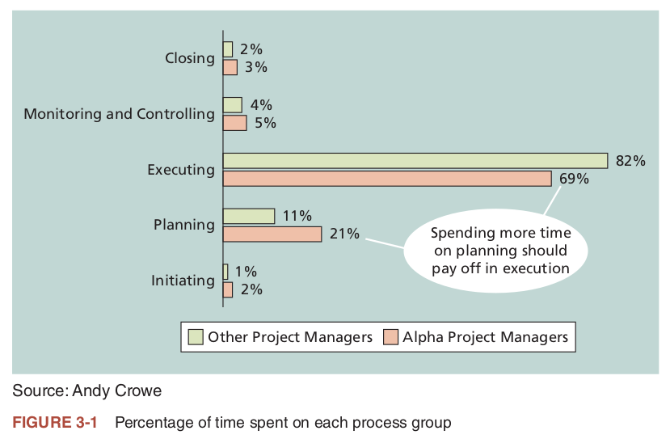
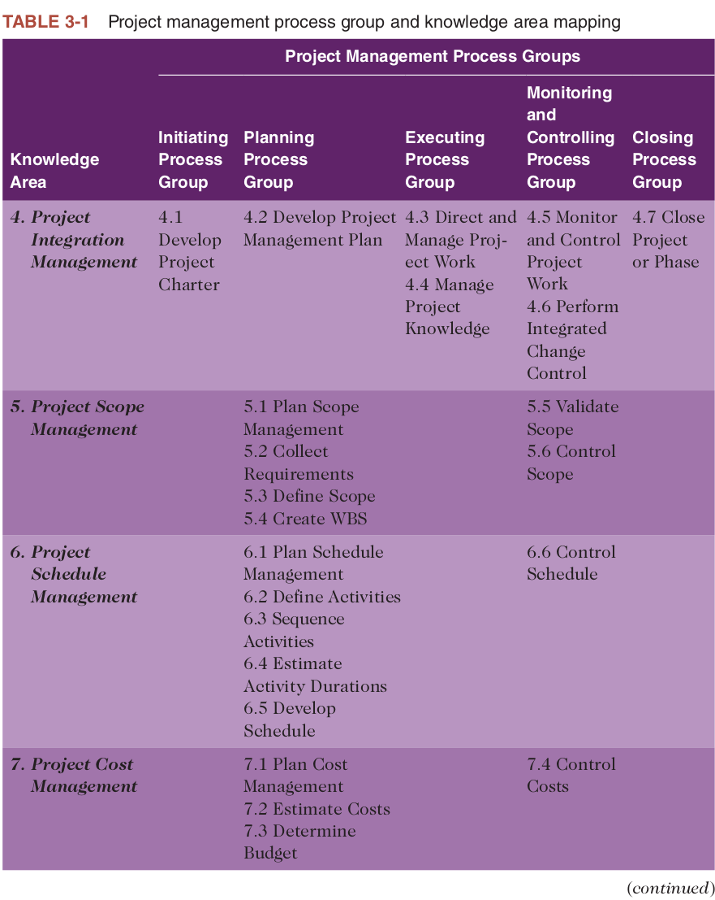
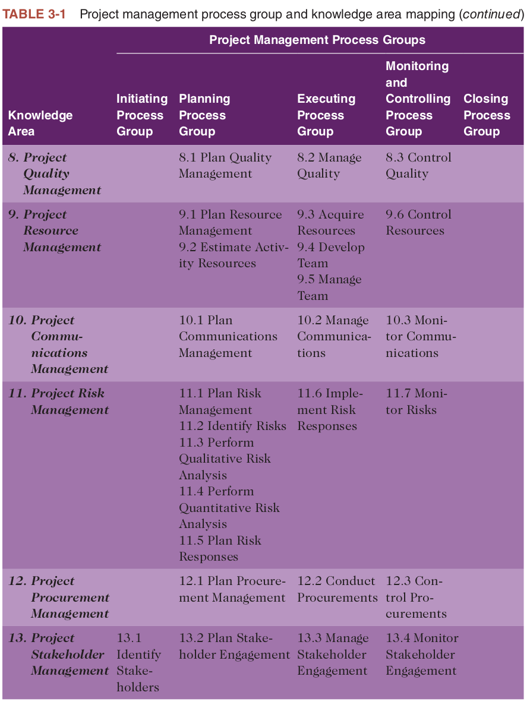

# Study Guide for Software Project Management

# Chapter 3: The Project Management Process Groups

1. **Project Management Process Groups**

2. **Mapping the Process Groups to the Knowledge Areas**

3. **Developing an IT Project Management Methodology**

4. **Case Study 1: JWD Consulting’s Project Management Intranet Site Project (Predictive Approach)**
    - 4.1 Project Pre-Initiation and Initiation
    - 4.2 Pre-Initiation Tasks
    - 4.3 Initiating
    - 4.4 Identifying Project Stakeholders
    - 4.5 Drafting the Project Charter
    - 4.6 Holding a Project Kick-Off Meeting
    - 4.7 Project Planning
    - 4.8 Project Execution
    - 4.9 Project Monitoring and Controlling
    - 4.10 Project Closing

5. **Case Study 2: JWD Consulting’s Project Management Intranet Site Project (Agile Approach)**
    - 5.1 Scrum Roles, Artifacts, and Ceremonies
    - 5.2 Project Pre-Initiation and Initiation
    - 5.3 Planning
    - 5.4 Executing
    - 5.5 Monitoring and Controlling
    - 5.6 Closing

6. **Templates by Process Group**

7. **Summary**

---

# My Study Guide

## 1. Project Management Process Groups

1. **Interconnected Processes**: Project management is an integrative endeavor, where actions in one area often impact other areas. In software projects, these connections could be particularly complex due to rapidly changing technology and requirements.

2. **Triple Constraint**: Trade-offs often need to be made between the project’s scope, time, and cost. In software development, this is especially pertinent when managing feature sets against deadlines and budgets.

3. **Five Key Process Groups**: These are Initiating, Planning, Executing, Monitoring and Controlling, and Closing. Each of these is essential in software projects for structured progression and risk management.

4. **Initiating Processes**: These include defining and authorizing a project or a project phase. In software projects, this often involves stakeholder meetings, requirement gatherings, and initial risk assessments.

5. **Planning Processes**: Here, various plans like scope management, schedule, and cost are developed. Planning is particularly crucial in software projects to deal with complexities and interdependencies.

6. **Executing Processes**: These processes are geared towards coordinating people and resources to meet the plans. In a software context, this includes tasks like coding, testing, and stakeholder communication.

7. **Monitoring and Controlling**: These processes are continuous and aim to ensure the project remains on track. In software projects, agile methodologies often integrate these activities within the development cycle for rapid adjustments.

8. **Closing Processes**: These involve the formal acceptance of the project and its orderly end, often overlooked but crucial in software projects for capturing lessons learned and ensuring proper handoff.

9. **Concurrent Processes**: The process groups are not mutually exclusive and often occur concurrently. This is particularly true in agile or hybrid software development methodologies.

10. **Resource Allocation**: Typically, executing tasks require the most resources and time, followed by planning tasks. In software projects, this often varies depending on the development methodology used.

11. **Applicability to Phases or Entire Project**: The process groups can be applied to each major phase or the entire project. In software development, this flexibility allows for adaptation to various methodologies like Waterfall or Agile.

12. **Importance of Planning**: Planning is emphasized as especially important, with data suggesting that better planning leads to more efficient execution. This is especially true in software projects where changes post-implementation can be costly.

13. **Outputs and Deliverables**: Each process group has specific outputs or deliverables. For software projects, these could range from code modules to documentation and client training.

14. **Monitoring and Adaptation**: Monitoring and controlling processes overlap all other process groups, allowing for constant adaptation. This is particularly crucial in software projects due to the fast-paced nature of technology changes.

15. **Closing Documentation**: The importance of formal closing documents like the final project report and lessons-learned report is highlighted. In software projects, these are critical for future maintenance and development.

Understanding and effectively applying these principles can greatly improve the chances of success in managing software projects.

---

## 2. Mapping the Process Groups to the Knowledge Areas

1. **Mapping to Knowledge Areas**: The process groups in project management can be mapped to 10 different knowledge areas. This is crucial for software projects where specialized knowledge in areas like risk management, quality assurance, and stakeholder management are often required.

2. **Flexibility of the PMBOK® Guide**: The PMBOK® Guide is versatile and can be applied to various types of projects, including those that use Agile methodologies. This is particularly useful for software projects that may adopt different development methodologies.

3. **Custom Methodologies**: Organizations often use the PMBOK® Guide as a foundation for developing their own project management methodologies. This is common in software development where organizations might blend traditional and Agile approaches.

4. **Focus on Planning**: Many of the project management activities occur during the planning process group. Given the complexity and fast-paced nature of software projects, planning is often the stage where issues can be preemptively addressed.

5. **Uniqueness of Each Project**: Every project is unique and requires a tailored approach. This is especially true in software development where technologies and requirements can differ widely between projects.

6. **Execution Requires Most Resources**: While planning is crucial, most of the time and money is usually spent on the execution phase. In software projects, this includes coding, testing, and deployment, which are resource-intensive tasks.

7. **Organizational Best Practices**: The section emphasizes the importance for organizations to determine how project management will work best for them. In the software industry, this often involves a mix of methodologies and tools suited to the specific type of software being developed.

8. **Importance of Team Decisions**: It's up to the project team to decide what processes and outputs are required, based on their specific needs. This is particularly important in software projects where the team’s expertise on the technology stack and development methodology is crucial.

Understanding these principles can provide a robust framework for managing software projects, aiding in the effective use of resources and successful project completion.

---

## 3. Developing an IT Project Management Methodology

1. **Tailoring Methodologies**: The PMBOK® Guide provides best practices but does not offer a one-size-fits-all solution. Organizations often develop their own methodologies to suit their specific needs, especially in the diverse field of software development.

2. **PRINCE2**: Originally designed for IT projects, PRINCE2 is a widely-used methodology that organizes tasks into eight process groups. It is particularly strong in governance and control, which are often required in large or complex software projects.

3. **Agile Methods**: Agile is ideal for projects that have a high degree of change and require rapid delivery. Several flavors of Agile methodologies like Scrum, XP, and SAFe are popular in software development for their flexibility and adaptability.

4. **Rational Unified Process (RUP)**: Developed by IBM, RUP is an iterative software development process that focuses on team productivity. RUP is often used in large software development projects where a structured yet flexible approach is needed.

5. **Six Sigma**: While not specific to software, Six Sigma's focus on quality and process improvement can be applied to software projects. Its methodologies like DMAIC and DMADV are often used to optimize existing processes or design new ones in software development.

6. **Other Software-Specific Methods**: Methods like Joint Application Development (JAD) and Rapid Application Development (RAD) are tailored for software development, focusing on user involvement and rapid prototyping, respectively.

7. **Adaptability**: Even if an organization uses a well-known standard like the PMBOK® Guide, it often needs to adapt it to its own unique work environment. In software development, this could include integrating coding standards, software architecture designs, or Agile sprint cycles.

8. **Case Studies**: The section mentions two case studies that apply different methodologies (predictive and adaptive) but still utilize the PMBOK® Guide's process groups. This demonstrates the flexibility and adaptability of established project management frameworks in real-world software projects.

9. **Unique Project Needs**: Every software project has its unique needs and challenges, necessitating a tailored approach. Organizations often blend ideas from different methodologies to create a hybrid approach that suits their specific project requirements.

10. **Resource Investment**: Developing a tailored project management methodology often requires a significant investment in time and training. However, the payoff can be substantial in terms of better project outcomes and more efficient use of resources.

Understanding and applying these principles can contribute to more effective and efficient software project management.

---

## 4. Case Study 1: JWD Consulting’s Project Management Intranet Site Project (Predictive Approach)

1. **Predictive Approach**: The case study highlights the use of a predictive or waterfall approach to project management. This is often suitable for projects where requirements are well-understood and changes are minimal, a situation not always present in software development but still common in some contexts.

2. **Tool Support**: Microsoft Project is used in the case study to manage various aspects of the project, emphasizing the value of project management software in keeping projects organized and on track. 

3. **Documentation**: The case study mentions the use of templates to prepare various project management documents. In software project management, such documents may include requirement specifications, architecture designs, and test plans, among others.

4. **Big Picture**: The case serves as a comprehensive example covering the project from start to finish. Understanding the 'big picture' is crucial in software project management to ensure that all elements, from requirements to deployment, are aligned.

### 4.1 Project Pre-Initiation and Initiation

1. **Strategic Alignment**: The section emphasizes that strategic planning should serve as the foundation for selecting and initiating projects. In the context of software project management, aligning IT projects with the organization's strategic objectives is crucial for ensuring that the projects deliver value and support business goals.

2. **Importance of Project Selection**: The text points out that it's better to have moderate success on an important project than huge success on an unimportant one. In software project management, project selection often involves evaluating the ROI, risk, and alignment with business objectives to ensure the project's importance and feasibility.

3. **Role of the Project Manager**: Ideally, the project manager should be involved in the initiation phase, but often they are chosen after initiation decisions have been made. This can be challenging in software projects, where the project manager's early involvement could help in shaping requirements and setting realistic expectations.

4. **Metrics for Success**: The case of JWD Consulting illustrates that clear performance metrics should be set to gauge the success of the project. In software projects, these metrics could include code quality, user adoption rates, and the speed of feature deployment, in addition to business-related metrics like cost savings and revenue generation.

These points underscore the need for careful planning and strategic alignment right from the initiation phase, especially in the fast-paced and often complex domain of software project management.

### 4.2 Pre-Initiation Tasks

1. **Determining Scope, Time, and Cost Constraints**: Before even initiating a project, it's essential to outline its scope, time, and cost constraints. In software projects, this usually involves understanding the functional and non-functional requirements, as well as high-level estimations of time and budget.

2. **Identifying the Project Sponsor**: Having a project sponsor is crucial for securing the necessary resources and for high-level decision-making. In software projects, the sponsor often comes from the business side and provides the project with organizational legitimacy and support.

3. **Selecting the Project Manager**: A project manager's role is critical in software projects for ensuring that the project meets its goals within the set constraints. Their early involvement can help in better planning and execution.

4. **Developing a Business Case**: This is a foundational document that justifies the investment into the project. In software projects, this often includes ROI calculations, cost-benefit analysis, and alignment with strategic objectives.

5. **Review Process and Expectations**: Senior management and the project manager should meet to review processes and set expectations. For software projects, this could include agreeing on development methodologies, reporting frequency, and key performance indicators (KPIs).

6. **Divide into Smaller Projects if Needed**: Breaking down a large project into smaller, more manageable parts can increase the odds of success, especially in software projects where scope creep is a common issue.

7. **Internal Review of Business Case**: Involving multiple departments like Finance in the review of the business case can provide a more rounded perspective and validation, particularly important for costly and complex software projects.

8. **Utilizing Templates and Past Projects**: Leveraging existing templates and case studies can speed up the business case development process. In software projects, this practice can also help in identifying common risks and mitigation strategies.

9. **Detailed Components in Business Case**: A comprehensive business case should include various sections like the problem statement, analysis of options, preliminary requirements, budget and schedule estimates, and potential risks. 

    This level of detail is equally important in software project management to ensure all bases are covered.  

    9.1 **Introduction/Background**: Provides context for the project, explaining why it is being considered.
    
    9.2 **Business Objective**: Clearly states what the project aims to achieve in business terms.
    
    9.3 **Current Situation and Problem/Opportunity Statement**: Describes the existing conditions and identifies the problem or opportunity that the project will address.
    
    9.4 **Critical Assumptions and Constraints**: Lists any assumptions being made as well as constraints that will limit the project’s options.
    
    9.5 **Analysis of Options and Recommendation**: Evaluates alternative approaches to meet the business objective and recommends the best option.
    
    9.6 **Preliminary Project Requirements**: Outlines the fundamental requirements that must be met for the project to be considered successful.
    
    9.7 **Budget Estimate and Financial Analysis**: Provides a high-level budget estimate and financial metrics like ROI (Return on Investment).
    
    9.8 **Schedule Estimate**: Gives a rough timeline for the project, including key milestones.
    
    9.9 **Potential Risks**: Identifies foreseeable risks that could affect the project's success.
    
    9.10 **Exhibits**: Includes any charts, graphs, or additional documents that support the business case.

10. **Validation and Approval to Proceed**: Once the business case is validated and approved, formal initiation tasks can begin. In the context of software projects, this might include more detailed requirements gathering, forming the development team, and setting up project infrastructure.

### 4.3 Initiating

1. **Identification of Stakeholders and Project Charter**: The initial step in formally initiating a project is to identify all stakeholders and develop a project charter. These documents are critical in setting the stage for the project and clarifying key roles, objectives, and constraints. In the context of software projects, this often includes not just business stakeholders but also technical leads, developers, and QA teams.

2. **Stakeholder Management Strategy**: While not always explicitly mentioned in every methodology, a stakeholder management strategy can be invaluable, especially in larger or more complex projects. This involves understanding the influence, interest, and expectations of each stakeholder and planning how to communicate and engage with them. This is particularly relevant in software projects where different stakeholders may have varying levels of technical expertise and different concerns (e.g., feature sets, performance, security).

3. **Kick-off Meeting**: Conducting a formal project kick-off meeting is a pivotal step in project initiation. This meeting serves to align the team, clarify objectives, and set initial expectations. In software project management, this is often where initial product backlogs might be reviewed, architectural discussions might commence, and roles within the team could be finalized.

### 4.4 Identifying Project Stakeholders

1. **Broad Definition of Stakeholders**: Stakeholders are not just the immediate team or the client; they include anyone who is impacted by the project. This can include support staff, users, and even opponents to the project. In software projects, this might also include end-users, QA teams, and regulatory bodies.

2. **Assembling a Strong Team**: The quality of the project team is often a significant determinant of project success. In the context of software development, key team members might include architects, developers, testers, and DevOps engineers.

3. **Client Involvement**: Involving client representatives in the project can offer valuable feedback and foster a sense of ownership. For software projects, this could also include beta testers or key users who can provide real-world usability feedback.

4. **Stakeholder Register**: Documenting stakeholder information, such as roles, contact information, and organizational affiliations, is essential. In software projects, this could extend to documenting the stakeholder's technical skills, which can inform the development process.

5. **Sensitive Stakeholder Information**: Some information about stakeholders can be sensitive, such as their level of support for or influence over the project. In software projects, this might include stakeholders who are gatekeepers for project approvals or resource allocation.

6. **Stakeholder Analysis**: This is a more in-depth look at stakeholders to gauge their level of interest and influence on the project. In software projects, this could help in identifying who the "champions" of the project are within the organization, or who might be blockers.

7. **Stakeholder Management Strategy**: It's crucial not only to identify stakeholders but also to have a plan for how to manage their expectations and involvement. In software projects, this can be particularly complex due to the fast pace and high levels of uncertainty.

8. **Confidentiality of Analysis**: Sensitive details from the stakeholder analysis are often kept confidential. In the context of software development, this could also include proprietary or internal procedures that are critical to project execution but sensitive in nature.

### 4.5 Drafting the Project Charter

1. **Conciseness and Clarity of the Charter**: The project charter in this example is designed to be one or two pages long, focusing on key information. This is in line with best practices in software project management, where a clear and concise charter can serve as a touchstone for all stakeholders, ensuring everyone understands the project's scope, objectives, and constraints.

2. **Stakeholder Signatures and Comments**: The inclusion of key stakeholder signatures and their comments on the project charter lends a level of commitment and agreement to the project. In the context of software projects, this is crucial for ensuring that all departments, from development to security, have a say in the project's initiation and are aligned with its goals.

3. **Addressing Concerns Early**: Concerns from team members, like those regarding other assignments or technical issues such as testing and security, are noted early on in the project charter. In software project management, this early identification of concerns allows for proactive planning and risk mitigation, ensuring that these issues do not become roadblocks later in the project.

### 4.6 Holding a Project Kick-Off Meeting

1. **Importance of the Kick-Off Meeting**: The kick-off meeting serves as the formal beginning of the project and is essential for setting the tone and direction. In software project management, this meeting is crucial for ensuring that all team members, who may come from different technical backgrounds, understand the project goals and timelines.

2. **Timing Relative to Documents**: The kick-off meeting is generally held after the business case and project charter are completed. This is key in software projects as well, ensuring that there is a foundational document that all stakeholders can refer to during the meeting.

3. **Virtual Inclusion**: The section notes that even if stakeholders must meet virtually, a kick-off meeting is still important. In the context of software development, which often involves remote or distributed teams, this is a crucial point.

4. **Agenda for the Meeting**: Having a structured agenda is essential for making the meeting productive. This is especially relevant in software projects where discussions can easily get sidetracked into technical details.

5. **Action Items and Follow-Up**: Documenting action items, who is responsible, and deadlines during the meeting is a best practice. In software projects, this helps in tracking tasks that are often interdependent and time-sensitive.

6. **Quick Documentation**: Sending out meeting minutes quickly after the meeting ensures that everyone is on the same page and can refer back to what was discussed. This is particularly useful in software projects where things move quickly, and decisions may need to be revisited.

7. **Focus on Results**: A focus on the results of the meeting, rather than just discussions, is emphasized. In the fast-paced environment of software development, focusing on actionable outcomes is essential for keeping the project on track. 

### 4.7 Project Planning

1. **Importance of Planning**: Planning is crucial for guiding project execution, yet it is often overlooked or viewed negatively.
  
2. **PMBOK Guide**: The PMBOK Guide – Sixth Edition is a key resource for understanding project planning, especially for those aiming for PMP® or CAPM® certification.

3. **Knowledge Areas and Outputs**: Planning covers various knowledge areas, and the outputs can differ depending on the organization's specific needs.

4. **Planning Documents**: For the project discussed, essential planning documents include a team charter, a project scope statement, a work breakdown structure, a project schedule, and a list of prioritized risks.

5. **Communication**: All project-related information is available on a project website to facilitate communication among team members.

### Team Building and Scope Clarification:
6. **Team Building**: Erica organized a team-building meeting to help team members get acquainted and work effectively together.

7. **Scope Clarification**: The team worked on identifying unclear aspects of the project scope and what they consider as main deliverables.

8. **Team Charter**: The team collaborated to create a team charter, which helps in promoting teamwork and clarifying communication channels.

### Work Breakdown Structure (WBS) and Scheduling:
9. **WBS Importance**: The Work Breakdown Structure is critical as it sets the groundwork for the project schedule and performance metrics.

10. **Project Scheduling**: The team participated in developing the project schedule, keeping in mind the dependencies between tasks and workload constraints.

### Budget and Cost Management:
11. **Budget Constraints**: The team was mindful of the project budget and schedule goals during the planning phase.

12. **Cost Estimation**: Labor rates and other costs were entered into Microsoft Project to manage the budget effectively.

### Risk Management:
13. **Risk Prioritization**: A list of prioritized risks was developed, which will be further elaborated into a risk register as the project progresses.

### 4.8 Project Execution

1. **Role of Execution**: This is the phase where the planned activities are carried out, often consuming the most resources. Execution is guided by the PMBOK® Guide – Sixth Edition.

2. **Focus on Deliverables**: Sponsors and customers usually focus on the deliverables related to the end product or service. Documentation and updating of planning documents are also essential parts of execution.

3. **Leadership and Communication**: Erica emphasized strong leadership and communication skills as critical for successful project execution. She ensured everyone understood the objectives of the intranet application project.

4. **Resource Utilization**: Erica made effective use of internal resources, such as formal change request forms and contract specialists, to aid in the project's execution.

5. **Reporting and Monitoring**: Milestone reports were essential for keeping the CEO, Joe, informed about the project's progress. These reports were reviewed weekly.

6. **Human Resource Challenges**: Managing team members effectively, as seen with Michael's case, requires adjusting communication styles and expectations to meet individual needs.

7. **Vendor Selection and Outsourcing**: Cindy faced challenges in deciding between in-house development and outsourcing for software, ultimately opting for the latter due to its business sense.

8. **Budget Adjustments**: An initial underestimate of $10,000 for software services required additional funds, which were approved upon discussion with the project sponsor, Joe.

9. **Top Management Support**: Joe’s support was crucial when the project faced challenges, such as a low response rate to surveys. His intervention significantly helped in data collection.

10. **Adaptability**: Erica showed flexibility in her approach, whether it was about the reporting tools used or the way she managed her team, adapting to the specific needs of the project.

11. **Conflict Resolution**: Conflicts, such as the one between Cindy and Kevin over software sourcing, were addressed through effective communication and decision-making.

12. **ROI Expectations**: Despite budget adjustments, the project was expected to pay for itself within a year, emphasizing the importance of balancing costs and benefits.

### 4.8.1 Best Practices

1. **Unique Execution Approach**: For the Quartier International de Montréal (QIM) project, the work was divided into packages for smaller-scale testing of management techniques. Adjustments were made to future work segments based on experience gained.

2. **Stakeholder Champions**: The QIM team identified champions in each stakeholder group to inspire others and achieve project goals.

3. **Communication Plan**: A dedicated website was set up to address public concerns, exemplifying the importance of effective communication.

4. **Two-Day Reviews**: These were conducted at the beginning of each project phase to discuss problems and develop solutions, helping to prevent conflicts.

5. **Financial Investor Involvement**: The project sought input from financial investors to increase their stake and commitment to the project.

6. **High-Quality Experts**: Emphasis was placed on hiring top-notch professionals like architects, engineers, lawyers, and urban planners, who were paid a fixed price and their fees were settled quickly.

7. **Other Notable Projects**: The section also mentions other projects like the AP60 Phase 1 Project in Quebec and the Adelaide desalination project in Australia, which were completed early and within budget, emphasizing the value of good project management.

8. **U.S. Firm Achievement**: Washington River Protection Solutions, LLC received the 2017 award for the Hanford Double Shell Tank AY-102 Recovery Project, which closed ahead of schedule and was 8% under budget.

9. **PMI’s Website**: For more information on award criteria and winners, PMI's website is a valuable resource.

### 4.9 Project Monitoring and Controlling

1. **Continuous Process**: Monitoring and controlling is an ongoing process that occurs throughout the life of the project and involves all project management knowledge areas.

2. **PMBOK® Guide Reference**: The PMBOK® Guide – Sixth Edition provides guidelines for the knowledge areas, processes, and outputs related to monitoring and controlling.

3. **Plan Updates**: In the example project, Erica and her team made several updates to the project management plan to reflect changes in scope, schedule, and budget.

4. **Corrective Actions**: The team took corrective actions when necessary, such as when survey responses were low or when issues arose with supplier negotiations.

5. **Progress Reports**: Team members submitted weekly progress reports, and Erica modified the existing template to gather more actionable information.

6. **Software Tools**: The team used enterprise-wide project management software, specifically Microsoft Project 2016, for tracking actual hours worked and for project analysis.

7. **Critical Path and Earned Value**: Special attention was paid to critical path analysis and earned value data to ensure the project was on track.

8. **Financial Considerations**: Additional funding was approved to keep the project on schedule, with the emphasis that the new system must pay for itself within a year.

9. **Benefit Capture**: Erica planned to start capturing benefits as soon as the testing phase began. She believed the new system would enhance productivity, even beyond initial projections.

10. **Unanticipated Benefits**: Erica discovered that the new system could allow her Project Management Office to maintain its level of service with fewer staff, an unexpected benefit.

11. **Performance-Based Contracts**: The firm's client contracts were often based on performance rather than hours billed, adding another layer of importance to effective project monitoring and control.

### 4.10 Project Closing

1. **Stakeholder and Customer Acceptance**: One of the key aspects of project closing is to gain acceptance of the final products and services from stakeholders and customers.

2. **Verification of Deliverables**: It's crucial to verify that all deliverables are complete before formally closing the project.

3. **Final Report and Presentation**: Most closing processes include a final report and presentation summarizing the project's outcomes, challenges, and lessons learned.

4. **Importance of Formal Closure**: Even if a project is canceled before completion, it's vital to have a formal closing to reflect and learn for future projects.

5. **Transition Plan**: Projects should transition smoothly into the normal operations of the company. For example, Erica included a transition plan detailing how the new intranet site will integrate into the firm's operations.

6. **PMBOK® Guide Reference**: The PMBOK® Guide – Sixth Edition provides guidelines for the knowledge areas, processes, and outputs related to project closing.

7. **Lessons-Learned Report**: A summary of what went well, what didn't, and why, often called a lessons-learned report, is usually prepared during this phase.

8. **Contract Closure**: If the project involved procurement, all contracts must be formally closed out.

9. **Client Acceptance Form**: It's often useful to have formal documentation of client acceptance, as was done by Erica via a client acceptance form.

10. **Good Documentation**: The final report should be comprehensive, including all project-related documents and even plans for future benefit analysis, as demonstrated in Erica’s final report.

11. **Celebrating Success**: Erica organized a project closure luncheon to celebrate the team's accomplishments and discuss lessons learned, emphasizing the human aspect of project closure.

12. **Quote by George Santayana**: The section quotes George Santayana, emphasizing the importance of remembering past projects to avoid repeating mistakes: “Those who cannot remember the past are condemned to repeat it.”

---

## 5. Case Study 2: JWD Consulting’s Project Management Intranet Site Project (Agile Approach)
### 5.1 Scrum Roles, Artifacts, and Ceremonies
{content-here}

### 5.2 Project Pre-Initiation and Initiation
{content-here}

### 5.3 Planning
{content-here}

### 5.4 Executing
{content-here}

### 5.5 Monitoring and Controlling
{content-here}

### 5.6 Closing
{content-here}

---

## 6. Templates by Process Group
{content-here}

---

## Key Terms

---

## Calculations

### Net Present Value (NPV)

- **Definition**: Used in economic feasibility to evaluate the profitability of an investment or project.
- **Formula**: NPV = Sum of (Rt / (1 + i) ^ t) for t from 0 to n
- **Units**: Currency (e.g., Dollars, Pounds, Euros)
- **Variables**: 
  - Rt = Cash inflow or outflow at time t (Currency)
  - i = Discount rate (Percentage)
  - t = Time period (Years)
  - n = Total number of time periods (Years)

### Risk Priority Number (RPN)

- **Definition**: Used in risk assessment to prioritize risks based on their severity, occurrence, and detection.
- **Formula**: RPN = Severity (S) x Occurrence (O) x Detection (D)
- **Units**: Score (unitless)
- **Variables**: 
  - S = Severity of the risk (Score)
  - O = Occurrence likelihood (Score)
  - D = Detection difficulty (Score)

---

## Summary

**Project management** involves a number of interlinked **processes**. The five **project management process groups** are **initiating**, **planning**, **executing**, **monitoring and controlling**, and **closing**. These processes occur at varying levels of intensity throughout each **phase** of a project, and specific **outcomes** are produced as a result of each process. Normally the **executing processes** require the most **resources** and **time**, followed by the **planning processes**. Spending adequate time in planning pays off in execution.

**Mapping** the main activities of each **project management process group** into the **10 project management knowledge areas** provides a big picture of what activities are involved in project management.

It is important to **tailor project management methodologies** to meet an organization’s particular needs. Some organizations develop their own **IT project management methodologies**, often using the **standards** in the **PMBOK® Guide** as a foundation. Popular methods like **PRINCE2**, **Agile**, **RUP**, and **Six Sigma** include project management processes.

The **JWD Consulting case study** demonstrates how one organization managed an **IT project** from start to finish. The case study provides samples of **outputs** produced for **initiating**, **planning**, **executing**, **monitoring and controlling**, and **closing**:
- **Business case**
- **Stakeholder register**
- **Stakeholder management strategy**
- **Project charter**
- **Kick-off meeting agenda**
- **Team charter**
- **Work breakdown structure**
- **Gantt chart**
- **List of prioritized risks**
- **Milestone report**
- **Progress report**
- **Lessons-learned report**
- **Final project report**

The second version of the same case study illustrates how to use **Scrum**, the leading **agile method**, to manage the project. Instead of releasing the new intranet software just once near the end of the project, the team could release three **iterations** of the software. This version of the case study introduced some new **tools**, including a **product backlog**, **sprint backlog**, and **burndown chart**. Later chapters provide detailed information for creating these and other **project management documents** and using several of the **tools and techniques** described in both versions of this case study.

---
